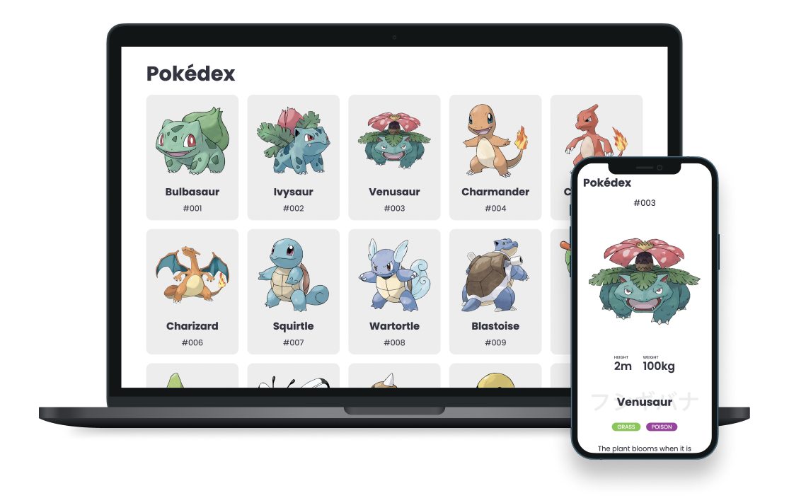

# Pokedex

A simple pokedex application developed to practice NextJS with TypeScript, Jest and Styled Components.

Design base on work of [Sulis Triyono](https://www.sulistryono.com/) published at [Dribbble](https://dribbble.com/shots/16833947-Mobile-Pokedex-App-Design-Exploration).

## Scripts

These scripts refer to the different stages of developing an application:

---

| Script: | Command:        | Description:                                                    |
| ------- | --------------- | --------------------------------------------------------------- |
| dev     | `npm run dev`   | Runs `next dev` to start Next.js in development mode            |
| build   | `npm run build` | Runs `next build` to build the application for production usage |
| start   | `npm run start` | Runs `next start` to start a Next.js production server          |
| lint    | `npm run lint`  | Runs next lint to set up Next.js' built-in ESLint configuration |
